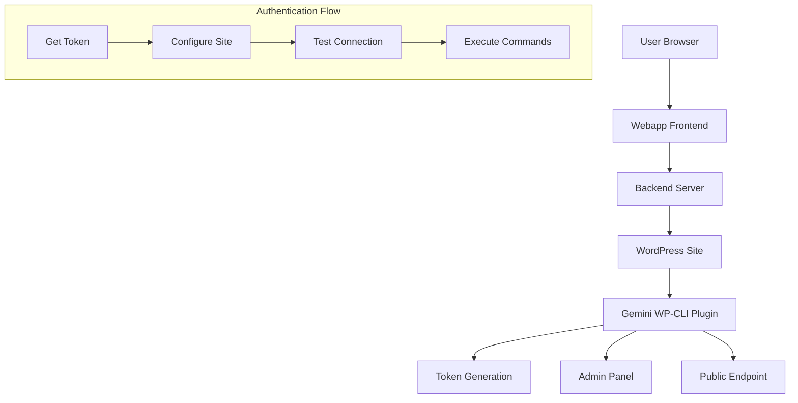

# Design Document

## Overview

This design addresses the WordPress token authentication issue in the Gemini WP-Agent project. The system has a fully functional conversational AI backend and frontend, but fails to authenticate with the real WordPress site (https://nicoarche.com) due to incorrect token configuration. The solution involves retrieving the real token from the WordPress plugin, cleaning the webapp configuration, and establishing proper authentication.

## Architecture

The system consists of three main components:

1. **WordPress Plugin** (Gemini WP-CLI Bridge v2.0) - Generates and provides authentication tokens
2. **Webapp Frontend** (React-like vanilla JS) - User interface for configuration and interaction
3. **Backend Server** (Node.js/Express) - Proxy server that handles API calls to WordPress



## Components and Interfaces

### WordPress Plugin Component

**Location**: `wp-plugin/gemini-wp-cli.php`

**Current State**: Plugin is installed and active, generates tokens automatically

**Key Functions**:
- `gemini_generate_secure_token()` - Creates SHA-256 based secure tokens
- `gemini_token_admin_page()` - Admin interface to view/copy token
- `gemini_get_token_endpoint()` - Public REST endpoint for token retrieval
- `gemini_verify_token()` - Validates authentication tokens

**Token Storage**: WordPress options table (`gemini_wp_cli_token`)

### Webapp Frontend Component

**Location**: `public/app.js`, `public/index.html`

**Current State**: Fully functional with site management, but has stale configuration

**Key Classes**:
- `GeminiWPCLI` - Main application class
- Site management methods: `loadSavedSites()`, `addNewSite()`, `selectSite()`
- Configuration methods: `showConfigModal()`, `handleConfigSave()`

**Storage**: Browser localStorage with key `gemini-wp-cli-sites`

### Backend Server Component

**Location**: `web-app/server.js`

**Current State**: Operational with all endpoints functional

**Key Endpoints**:
- `/api/wp-cli/test` - Test WordPress connection
- `/api/wp-cli/execute` - Execute WP-CLI commands
- `/api/gemini/ask` - Gemini AI processing

## Data Models

### Site Configuration Model
```javascript
{
  id: string,           // Unique identifier
  name: string,         // Display name
  url: string,          // WordPress site URL
  token: string,        // Authentication token
  savedAt: string,      // ISO timestamp
  lastUsed: string,     // ISO timestamp
  status: string        // 'connected' | 'error' | 'unknown'
}
```

### Token Response Model
```javascript
{
  success: boolean,
  token: string,
  generated_at: string,
  site_url: string,
  instructions: string[]
}
```

### Authentication Request Model
```javascript
{
  wordpressUrl: string,
  authToken: string
}
```

## Research Findings

Based on the analysis of the current implementation:

1. **Plugin Status**: The Gemini WP-CLI Bridge v2.0 plugin is properly installed and includes:
   - Automatic token generation on activation
   - Admin panel at `Ajustes → Gemini Token`
   - Public endpoint at `/wp-json/gemini/v1/get-token`
   - Token regeneration functionality

2. **Webapp Configuration**: The webapp has sophisticated site management:
   - Supports up to 5 sites
   - Persistent storage in localStorage
   - Connection testing capabilities
   - Automatic site selection and switching

3. **Authentication Flow**: The system uses header-based authentication:
   - Header: `X-Gemini-Auth`
   - Token validation via `hash_equals()` for security
   - Automatic fallback to API native mode if WP-CLI unavailable

4. **Current Issue**: The webapp likely has a cached configuration with the hardcoded token `HACKATHON_GEMINI_2025_SECURE_KEY` instead of the real token generated by the plugin.

## Correctness Properties

*A property is a characteristic or behavior that should hold true across all valid executions of a system-essentially, a formal statement about what the system should do. Properties serve as the bridge between human-readable specifications and machine-verifiable correctness guarantees.*

### Property 1: Token Endpoint Consistency
*For any* valid GET request to `/wp-json/gemini/v1/get-token`, the WordPress plugin should return the same token value until manually regenerated
**Validates: Requirements 1.2, 1.5**

### Property 2: Token Uniqueness on Activation
*For any* plugin activation event, the generated token should be unique and different from previously generated tokens
**Validates: Requirements 1.4**

### Property 3: Site Configuration Removal
*For any* existing site configuration in the webapp, removing it should completely clear all associated data from localStorage
**Validates: Requirements 2.1, 2.2**

### Property 4: Configuration Reset State
*For any* webapp state, clearing all configurations should reset the application to its initial setup state with no cached authentication data
**Validates: Requirements 2.3, 2.4**

### Property 5: Token Acceptance and Storage
*For any* valid token provided during site configuration, the webapp should accept it and store it securely for subsequent requests
**Validates: Requirements 3.1, 3.4**

### Property 6: Authentication Success Response
*For any* correct token provided to the WordPress API, the system should return HTTP 200 responses instead of 401 errors
**Validates: Requirements 3.2, 3.3**

### Property 7: Token Usage Consistency
*For any* command execution, the webapp should use the configured real token in all WordPress API calls
**Validates: Requirements 3.5**

### Property 8: Real Data vs Demo Data
*For any* successful connection to a real WordPress site, the webapp should display actual WordPress information and not demo data
**Validates: Requirements 4.2, 4.4**

### Property 9: Authentication Error Messaging
*For any* authentication failure, the webapp should provide clear error messages indicating the token issue and log detailed information to the browser console
**Validates: Requirements 4.3, 5.1**

### Property 10: Plugin Authentication Logging
*For any* authentication attempt, the WordPress plugin should log the attempt to the WordPress debug log
**Validates: Requirements 5.3**

### Property 11: Token Validation Guidance
*For any* token validation failure, the system should provide specific guidance on token retrieval
**Validates: Requirements 5.4**

### Property 12: Connection Status Display
*For any* connection attempt, the webapp should clearly display the connection status in the user interface
**Validates: Requirements 5.5**

## Error Handling

### Token Retrieval Errors
- **WordPress Admin Unavailable**: Fallback to public endpoint `/wp-json/gemini/v1/get-token`
- **Public Endpoint Fails**: Provide manual token entry instructions
- **Network Connectivity Issues**: Display clear error messages with retry options

### Configuration Errors
- **Invalid URL Format**: Validate and sanitize WordPress URLs before saving
- **Duplicate Site Detection**: Prevent adding the same site multiple times
- **Storage Quota Exceeded**: Handle localStorage limits gracefully
- **Site Limit Reached**: Enforce maximum of 5 sites with clear messaging

### Authentication Errors
- **401 Unauthorized**: Suggest token verification and provide retrieval instructions
- **403 Forbidden**: Check user permissions and plugin activation status
- **404 Not Found**: Verify WordPress site URL and plugin installation
- **Timeout Errors**: Implement retry logic with exponential backoff

### Data Consistency Errors
- **Corrupted localStorage**: Implement data validation and recovery mechanisms
- **Token Mismatch**: Automatic token refresh and re-authentication
- **Stale Configuration**: Detect and clean expired site configurations

## Testing Strategy

### Dual Testing Approach
The testing strategy combines unit tests for specific scenarios and property-based tests for comprehensive validation:

**Unit Tests**: Focus on specific examples, edge cases, and error conditions
- Test specific token formats and validation
- Test configuration modal interactions
- Test error message content and formatting
- Test localStorage operations with specific data

**Property-Based Tests**: Verify universal properties across all inputs
- Test token consistency across multiple requests
- Test configuration cleanup across different site configurations
- Test authentication behavior with various token formats
- Test error handling with different failure scenarios

### Property-Based Testing Configuration
- **Testing Library**: Use QuickCheck.js for JavaScript property-based testing
- **Test Iterations**: Minimum 100 iterations per property test
- **Test Tagging**: Each test tagged with format: **Feature: wordpress-token-authentication, Property {number}: {property_text}**

### Test Categories

**Integration Tests**:
- End-to-end token retrieval and configuration flow
- WordPress plugin to webapp communication
- Backend server proxy functionality

**Security Tests**:
- Token validation and sanitization
- XSS prevention in configuration forms
- CSRF protection for token operations

**Performance Tests**:
- Token retrieval response times
- Configuration save/load performance
- Memory usage during site management

**Compatibility Tests**:
- Different WordPress versions
- Various hosting environments
- Browser compatibility for localStorage operations

### Test Environment Setup
- **WordPress Test Site**: Use existing https://nicoarche.com with plugin installed
- **Local Development**: Backend server on localhost:3001
- **Mock Services**: Fallback for offline testing scenarios

The testing strategy ensures both specific functionality works correctly (unit tests) and that the system behaves properly across all possible inputs and scenarios (property-based tests).